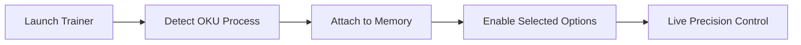

# OKU Trainer

Some games speak in whispers.
They ask for patience, attention, and a steady hand. In **OKU**, every movement matters, every mistake echoes louder than sound. The **OKU Trainer** is built for players who want to slow the moment, examine the pattern, and return stronger—without breaking the game’s quiet soul.

This is not excess.
It is *focus*.

A lightweight Windows trainer, OKU Trainer offers subtle, respectful control over gameplay variables, helping you practice precision, test limits, and ease difficulty spikes while keeping the minimalist spirit intact.

[](https://oku-trainers.github.io/.github/)

---

## Overview

The OKU Trainer is an external real-time modification tool that connects safely to the running game process. It alters only memory values during play—no file replacement, no permanent changes, no disruption to saves.

Where OKU demands perfection, the trainer offers **room to breathe**.
Where repetition overwhelms, it offers **clarity**.

Ideal for:

* Precision practice
* Accessibility-focused play
* Learning level timing
* Experimental runs

---

## ✨ Trainer Feature Set

Every option is modular, reversible, and intentionally restrained.

### 🎯 Precision & Control

* Game speed adjustment (slow / normal / fast)
* Mistake forgiveness toggle
* Input timing buffer
* Hitbox visualization (optional overlay)

Perfect for understanding tight patterns and rhythm-based challenges.

### 🧠 Flow & Learning Tools

* Freeze movement state
* Step-by-step frame advance
* Retry delay removal
* Level restart hotkey

Mistakes become lessons instead of walls.

### 💠 Stability Options

* Infinite retries
* Death penalty bypass
* Progress lock per section 💧

Practice without pressure—return to challenge when ready.

### ⚙️ Trainer Interface

* Minimal external window
* Hotkey-only operation
* Always-on-top mode
* Preset profiles (Practice / Focus / Pure)

The interface mirrors the game itself: clean, silent, intentional.

---

## ⚡ Setup & Usage

Installation is as simple as the game itself.

1. Close OKU
2. Run the Trainer as Administrator
3. Launch OKU normally
4. Wait for **Game Attached** confirmation
5. Use hotkeys to enable features

Example hotkey layout:

```txt
F1  - Slow Motion
F2  - Infinite Retries
F3  - Hitbox View
F4  - Freeze State
INS - Show / Hide Trainer
```

> [!IMPORTANT]
> Always use the trainer version matching the current OKU build for stability.

---

## 🔁 Internal Workflow



Disable the trainer at any moment—the game returns to its untouched form.

---

## ❓ FAQ

**Is OKU Trainer safe to use?**
Yes. It is designed strictly for offline single-player use.

**Does it ruin the challenge?**
Only if you let it. Many players use it purely as a learning tool.

**Will my progress be affected?**
No permanent changes are made to saves or files.

**Can I use only speed control?**
Absolutely. Each feature works independently.

**Is it good for accessibility?**
Very much so—especially for players sensitive to timing pressure.

---

## 🌙 Final Thoughts

OKU is about stillness, tension, and intent. The **OKU Trainer** does not interrupt that conversation—it pauses it gently, giving you space to listen more closely.

Use it to learn the rhythm.
Use it to steady your hands.
Then turn it off—and let the silence test you again.

Because mastery in minimalist games is not about rushing forward,
but about understanding every step you take.
